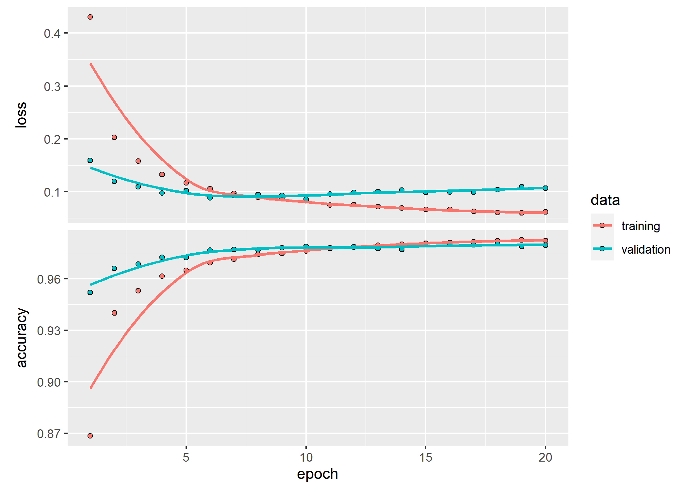

---
title: Installation the Tensorflow & Keras in R
author: JaeKwan Koo
date: 2020-10-25 16:00:00 +0900
categories: [R Blog, R]
tags: [Tensorflow, Keras]
pin: false
---  

  - [ANACONDA](#anaconda)
      - [First trial](#first-trial)
  - [conda env](#conda-env)
      - [Library](#library)
      - [Set the environment](#set-the-environment)
      - [installation reference](#installation-reference)
  - [Example : MNIST](#example-mnist)

## ANACONDA

Python을 기반으로 구동되기 때문에 기본적으로 anaconda를 설치하면 r에서 tensorflow와 keras를 설치할 수
있다고 한다.

하지만, 나의 경우에는 에러 메시지가 뜨면서 되지가 않았다.  
며칠동안 검색해서 해결해보려고 했는데 똥손이라 어쩔 수 없는거 같다.

<br>

먼저 anconda설치 후, tensorflow와 keras를 설치해서 되는지 확인해보자.

### First trial

``` r
devtools::install_github("rstudio/keras")
devtools::install_github("rstudio/tensorflow")

install_tensorflow()
install_keras()
```

[rstudio/tensorflow 참조](https://github.com/rstudio/tensorflow)  
[rstudio/keras 참조](https://github.com/rstudio/keras)

<br> <br>

여기서 처음에 봤던 에러 메시지가 뜨면서 안된다면 아래 방법을 이용하면 안정성있게 이용할 수 있다.

## conda env

먼저, r-tensorflow라는 가상환경을 conda를 통해 지정한다.(이름은 사실 아무거나 해도 상관없다.)

1.  윈도우버튼 누르고 cmd창을 켠다.  
2.  anaconda가 설치된 상황에서 **conda create -n r-tensorflow r-essentials
    r-base** 를 통해 r의 가상환경을 만들어준다.  
3.  밑의 코드로 환경설정을 한다.  
4.  `install_tensorflow()`, `install_keras()`로 설치

주의할 점은 자신의 아나콘다가 설치된 경로와 가상환경이름을 사용해야한다.  
또 중간에 에러가 생기면, 필요한 패키지들은 알아서 설치하도록 한다.

아래는 위의 번호에 해당하는 설치 과정을 나타낸다.

### Library

``` r
library(keras)
library(tensorflow)
library(reticulate)
```

### Set the environment

``` r
# set anaconda to tensorflow environment

# reticulate::use_condaenv("C:/Users/koojaekwan/anaconda3/envs/r-tensorflow")

use_condaenv(condaenv = "r-tensorflow", 
             conda = "C:/Users/koojaekwan/anaconda3/envs/r-tensorflow/python.exe")


Sys.setenv(RETICULATE_PYTHON = "C:/Users/koojaekwan/anaconda3/envs/r-tensorflow")
```

use\_condaenv는 둘 중 아래것만 써도 되는것 같다.

``` r
install_tensorflow()
install_keras()
```

### installation reference

<https://stackoverflow.com/questions/20337202/using-python-virtual-env-in-r>

<https://www.rdocumentation.org/packages/reticulate/versions/1.16/topics/use_python>

<https://stackoverflow.com/questions/50145643/unable-to-change-python-path-in-reticulate-r>

<https://stackoverflow.com/questions/24283171/virtual-environment-in-r>

<https://tensorflow.rstudio.com/installation/custom/>

<https://tensorflow.rstudio.com/reference/keras/install_keras/>

<https://docs.anaconda.com/anaconda/user-guide/tasks/using-r-language/>

<https://stackoverflow.com/questions/44025728/r-tensorflow-anaconda-install-on-windows>

## Example : MNIST

잘 작동하는지 MNIST예제를 통해 확인해보자.  

``` r
mnist <- dataset_mnist()
x_train <- mnist$train$x
y_train <- mnist$train$y
x_test <- mnist$test$x
y_test <- mnist$test$y


# reshape
x_train <- array_reshape(x_train, c(nrow(x_train), 784))
x_test <- array_reshape(x_test, c(nrow(x_test), 784))
# rescale
x_train <- x_train / 255
x_test <- x_test / 255

y_train <- to_categorical(y_train, 10)
y_test <- to_categorical(y_test, 10)

model <- keras_model_sequential() 
model %>% 
  layer_dense(units = 256, activation = 'relu', input_shape = c(784)) %>% 
  layer_dropout(rate = 0.4) %>% 
  layer_dense(units = 128, activation = 'relu') %>%
  layer_dropout(rate = 0.3) %>%
  layer_dense(units = 10, activation = 'softmax')

summary(model)
```

    ## Model: "sequential"
    ## ________________________________________________________________________________
    ## Layer (type)                        Output Shape                    Param #     
    ## ================================================================================
    ## dense (Dense)                       (None, 256)                     200960      
    ## ________________________________________________________________________________
    ## dropout (Dropout)                   (None, 256)                     0           
    ## ________________________________________________________________________________
    ## dense_1 (Dense)                     (None, 128)                     32896       
    ## ________________________________________________________________________________
    ## dropout_1 (Dropout)                 (None, 128)                     0           
    ## ________________________________________________________________________________
    ## dense_2 (Dense)                     (None, 10)                      1290        
    ## ================================================================================
    ## Total params: 235,146
    ## Trainable params: 235,146
    ## Non-trainable params: 0
    ## ________________________________________________________________________________

``` r
model %>% compile(
  loss = "categorical_crossentropy",
  optimizer = optimizer_rmsprop(),
  metrics = c("accuracy")
)

history <- model %>% fit(
  x_train, y_train, 
  epochs = 20, batch_size = 128, 
  validation_split = 0.2
)

plot(history)
```



``` r
model %>% evaluate(x_test, y_test)
```

    ##       loss   accuracy 
    ## 0.09791305 0.98000002

``` r
model %>% predict_classes(x_test[1:10, ])
```

    ##  [1] 7 2 1 0 4 1 4 9 5 9  


앞 10개에 대한 prediction value이다.  
